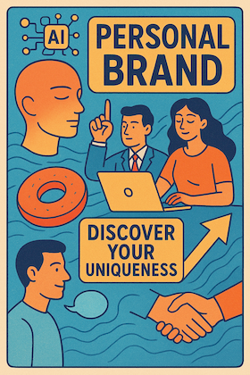

# AI时代的个人品牌
朋友推荐这一关键个人发展心法:
[Afraid AI will replace you? Watch This. - YouTube](https://www.youtube.com/watch?v=HxTjtp5WSUM)




吻合自己一直以来对大V 的观感:

> ...每个人都有独特的才能和兴趣，这些构成了他们的身份。通过投入时间和技能，我们可以在这些基础上建立自信，并实现自我成长与发展。

问题在, 整个儿社会的所有机制都在扼制这种独特的被发现和加强..
所以, 个人品牌 建立的第一个巨大困难就是:
    不知道自己独特之处在哪儿..

- 毕竟只有很少人从一开始就知道自己是谁, 自己要成为什么..
- 好在, 这种重新遇见自己的渠道非常简洁:
- 持续发表自己的见解,
- 慢慢的自己作为自己的第一读者, 从中自然就发现了自己真正最擅长以及关注的领域以及配套的完备技能树...

当然, 这一走向真我的过程中, 如果有及时正向的反馈可以健康加速这一过程...

这就是各种社区真正的价值了,
每个能长期运营良好的社区, 都是一个个具体品牌了,
而每个品牌都是单纯又丰富的, 以一个简洁不变的目标, 持续聚集各种有踙的好人,
长期致力相同目标, 发生发展出超出所有人想象的各种作品...

这个过程中, 最珍贵的资产不是各种作品, 而是形成作品过程中, 大家因为相同的困难突破过程中相互支持引发的情绪回响...或是说`故事`,大家专有的故事,
无论多少年, 重新聚集在一起, 反复回顾也不会感觉无聊的故事...


## PS:
> AI 总结的视频要点:

在人工智能时代，个人品牌的重要性愈发突出。Chris Doe在夜总会中探讨了如何在喧嚣中脱颖而出，强调真实和诚意是成功的关键。他指出，AI虽然可能取代某些工作，但也促使人们渴望真实的人际互动。通过与观众的互动，Chris鼓励大家关注自我表达，保持真实性，并利用AI作为工具来提升创作，而非取代创作。最终，建立个人品牌的核心在于勇于做自己，并与他人建立真实的联系。


亮点:

00:00 在人工智能时代，个人品牌的重要性愈发显著。为了在这个喧嚣的世界中脱颖而出，我们需要保持真实和诚实，专注于能够控制的事物。
          -人工智能的普及带来了新的挑战和机遇。我们必须在使用这些工具的同时，保持人性和真实的自我，以适应这个快速变化的环境。
          -YouTube对AI生成内容的去货币化政策显示了对人类创作内容的重视。这一举措可能鼓励更多真实、有灵魂的创作者，而非无情的自动化内容生产。
          -AI作为放大器，能增强我们的声音，但也带来了噪音。因此，创作者需要更加负责地选择和发布内容，以保持原创性和真实性。
08:03 我们内心深处有一种需要他人认可的倾向，这使我们在生活中面临许多挑战。为了克服这种心理，我们首先必须相信自己足够优秀，并制定计划来提高自我认知和能力。
          -自我认可的过程是一个渐进的旅程，许多人在成长过程中会将父母的认可转移到他人身上。学习自我肯定和建立自信心是克服这种依赖的关键。
          -在追求技能发展的过程中，持之以恒和耐心是必不可少的。成功并非一蹴而就，很多人往往只看到他人成功后的成果，而忽视了背后的努力和付出。
          -随着人工智能的发展，许多传统的低技能工作将被取代。我们需要重新审视工作内容，专注于利用创造力和想象力来创造更有价值的工作。
16:09 人们对观看平凡工作的视频产生了兴趣，这种趋势不仅让观看者感到满足，也为内容创作者提供了盈利的机会。通过展示日常工作的专业性，人们能够获得观众的关注并实现收入增长。
          -在内容创作中，展示普通工作的高效和专业性成为一种新的趋势。这种方式吸引观众关注，并让创作者获得可观的观看量和收入。
          -用户体验设计（UX）的重要性在于为用户提供良好的最终体验。通过理解用户需求和问题，设计师能够改善用户体验，从而提升产品质量。
          -使用人工智能（AI）来优化工作流程可以提高效率。记录个人的工作过程并分析，可以帮助设计师识别自己的工作步骤并获得改进建议。
24:14 在选择与他人合作时，保护自己的时间和精力至关重要。通过设定标准和要求，确保对方能够为你带来价值，从而避免浪费时间在不必要的会谈上。
          -面对新市场的设计师，必须找到适应快速变化的策略，同时保持耐心和自我成长。了解行业动态与培养自己的设计能力是成功的关键。
          -在人工智能时代，传统的艺术与人文学科的知识变得愈发重要。能够有效表达和沟通这些知识的人将成为设计行业的新领军者。
          -追求设计的品味和历史知识是提高设计能力的有效途径。通过不断学习和实践，能够逐渐培养出敏锐的设计眼光和判断力。
32:30 人工智能的应用可以极大提升个人和小团队的工作效率。通过合理的使用和沟通，AI能够帮助我们快速生成高质量的内容，节省时间并提高生产力。
          -使用人工智能制作内容时，质量是关键。无论是制作总结、社交媒体帖子还是其他形式的内容，确保基础材料的优秀是成功的前提。
          -有效的沟通技巧在内容创作中至关重要。能够清晰表达思想和反馈是确保AI生成内容符合期望的核心能力。
          -面对社交焦虑，人工智能可以提供支持。通过非暴力沟通的技巧，AI可以帮助人们更好地表达自己，减轻内心的负担。
40:20 在现代创意产业中，原型设计是一个重要的工具，可以帮助创意人士更好地与客户沟通。通过降低客户的想象负担，设计师可以更有效地销售他们的创意，进而提升工作效率和客户满意度。
          -使用原型设计可以有效减少客户在购买过程中的心理负担。这种方法不仅帮助客户理解设计意图，还能增加他们对最终产品的信心，从而提高成交率。
          -人工智能在原型设计中的应用可以极大地提升创作效率。通过快速生成初步设计，创意人士能够更加专注于细节和客户反馈，最终实现更高质量的成果。
          -长格式内容创作在现代品牌传播中占据重要地位。通过讲述故事和提出解决方案，创作者可以更有效地吸引观众的注意力，并促使他们对品牌产生兴趣。
48:23 人们可以利用科技创造出智能机器人，进行知识和技能的总结与分享。这种创新依赖于人类的想象力和创造力，能够为个人和企业提供巨大的价值和帮助。
          -创建个人品牌需要勇气，尤其是要面对被他人不喜欢的可能性。许多人因为害怕被孤立而不敢展现真实的自我，导致个人品牌的形成受到限制。
          -要形成独特的个人品牌，必须找出自己在众人中的不同之处。通过改变外观或表达方式，能够有效地吸引他人的注意，从而在竞争中脱颖而出。
          -与他人不同的思维方式能够帮助个人在商业环境中取得成功。通过反向思考，了解如果想要融入群体需要做什么，从而避免做出相同的选择。
56:27 个人形象和品牌在社交场合中起着至关重要的作用。通过正确的穿着和呈现，个人可以改变他人对自己的看法，从而提升自信和影响力。
          -在购物的过程中，个人的穿着选择可以反映出他们的身份和自信水平。尽管有时人们会感到不适，但勇于尝试新的风格可以带来意想不到的积极反馈。
          -当个人的穿着与其内心意图相符时，外界的反应会大不相同。通过调整外在形象，个人可以在社交场合中获得更多的关注和认可。
          -品牌的力量在于它所传递的信息和价值。即使产品本身优于品牌，良好的品牌形象依然能够在竞争中占据优势，吸引更多的关注。
1:04:29 在早期的YouTube发展中，建立品牌的重要性不容忽视。即使在粉丝数量较少的情况下，拥有一个强大的YouTube频道也能为创作者带来无限的创意和未来机会。
          -创作者在选择保留品牌和产品时，认为品牌的价值远超产品本身。品牌不仅是名称，更是与观众建立信任和忠诚关系的基础。
          -有效的品牌可以帮助创作者在面对困境时重新建立自己的事业，而不仅仅依赖于已有的产品。品牌与观众的关系才是核心所在。
          -在社交媒体时代，创作者需要不断创新以满足观众的需求。成功的品牌能够在竞争中脱颖而出，这也反映了创作者的能力和价值。
1:12:33 建立个人品牌的关键在于与受众建立真实的关系，而非单纯追求销售或市场营销。通过建立忠诚度和信任，可以有效提升品牌的价值和影响力，最终实现可持续的业务增长。
          -成功的个人品牌依赖于强大的受众关系。拥有一个稳定的社区和支持者，可以在面对挑战时更容易恢复，甚至在失去社交媒体账号的情况下依然保持影响力。
          -品牌的价值不仅在于外观或名称，更在于谁控制了与受众的关系。通过与受众建立信任和忠诚，品牌能够在市场上获得竞争优势。
          -在建立个人品牌时，需要关注如何与受众进行真实互动，而不是单纯追求销售转化。识别受众的需求，并提供解决方案是建立深厚关系的有效途径。
1:20:37 艺术的真正价值在于能够被他人欣赏和理解。追求个人品牌的同时，保持真实的自我对建立深层次的连接至关重要。只有真实的表达才能打破与观众之间的壁垒，形成有效的沟通。
          -在创作过程中，技术细节也很重要，如音频质量和内容的可发现性。为了让观众更容易找到你的作品，必要的技术投入是不可或缺的，这样才能保证艺术的传播效果。
          -追逐流行和算法可能导致失去自我。真正的成功在于展现真实的自我，而不是迎合外界的期望，这样才能吸引真正欣赏你的人。
          -建立个人品牌并不意味着放弃与集体的联系。通过展现独特的自我，反而可以更好地与他人建立共鸣，形成更深的社会连接。
1:28:38 每个人都有独特的才能和兴趣，这些构成了他们的身份。通过投入时间和技能，我们可以在这些基础上建立自信，并实现自我成长与发展。
          -拥有强大的根基是实现自我成长的关键。无论我们选择什么样的表达方式，重要的是要相信自己并投入其中，才能收获不同的成果。
          -许多人在追求社会的标准时，往往忽视了自己的独特性。我们常常觉得自己的兴趣不够“正常”，因此不愿围绕这些兴趣建立身份。
          -支持和鼓励来自周围的人对我们的身份认同至关重要。通过社群的支持，我们能够更好地理解和接受自己的独特性，从而更有信心地追求自己的梦想。


```
|> 250904 日糟:
1/4(每天吐糟不应超过4次)

          _~^-`~_
      () /  ← ☉  \ \/
        '_   ⌐   _'
        > '--.--' <

...act by ferris-actor v0.2.4 (built on 23.0303.201916)
```