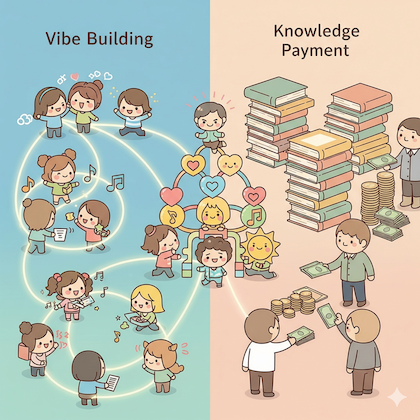

# 知识付费和 vibe building
在一个以 #FMHub 为社区, 以未日危机游戏为项目的群中, 忽然被问:

> ..因为你在一堂这个社群里，我会好奇于，在现在这一个经济环境，其实现在的知识付费人群和过去的知识付费人群有什么样的差异呢？因为其实我肉眼可见，因为经济形势的变化，有很多人已经不对知识付费像过去经济上行的时候产生浓厚的兴趣。但是有意思的是，因为知识付费这个赛道很多人倒闭了，导致其实这个行业是不是真的没得做，也是一个值得探讨的话题，所以我想问的是，你觉得这群学员的心态、状态以及他们付费的动机是什么呢？这是我想去探讨的@ZoomQuiet大妈 
> 举个例子，近段时间我也联系了一些之前在VC资本机构的朋友，出来聊聊现在VC投资和FA这个行业的现状。有趣的是，虽然现在一级市场远远不像以前那么好做，但是因为在大湾区、珠三角太多机构倒闭了，导致现在反而是剩者为王，能够生存的下去，反而有过去没有的机会，这也让我联想到知识付费其实也会存在这么一个现象




## 俺的偏见

俺上了一次免费课就离开了,
因为, 俺也创建过在线课程, 所以, 理解本质竞争在哪儿...

一堂/yitang , 作为以太投资旗下产品, 也挣扎过, 现在按照官方的定义:
    作为一个研究机构,
    以减少青年创业失败成本为目标,

构建一系列课程, 和学员共建, 并在可能的情况下引入投资以及其它资源的形式来完成长期陪伴;

之所以, 触及到俺, 
主要原因, 就是你发现的核心困难:

    付费动机...

这课程最初是免费的, 以 "CEO 请客交个朋友" 为名,
通过发放免费名额来邀请朋友,
而邀请数量以及主动传播行为, 
在课程中, 是被反复鼓励甚至于绑定学分进行激励的流量裂变行为...

也就是说, 一堂, 可能最成功的是原创了一整套在线直播课程中的持续 `PUA`(内部激励)套路/机制/话术...

同时, 和 `Geek时间之类` 知识付费 不同, 

一堂主打的是创业经验的无私分享,

- 也就是说, 最为触动的人群, 是有些资金, 冲动, 想创业的各种人士;
- 本质上就是 YC/奇绩/以太/... 以往举办的创业选拔的降级...
- 根本不是 知识付费 逻辑..

> 俺的理解哈...

不过, 在线知识付费, 现在被 大模型给压缩没了,

- 但是, 在线/线下 伴学服务永远有价值,
- 因为, 知识的阐述媒介无论怎么丰富和免费, 从知识的记述变成自己的经验/技能/..j 过程是任何人/服务/设备 当前无法帮上忙的,
- 只能自学积累, 所以, 过程中各种经验/心理/社会资源/...的磨擦力, 
- 是值得通过专业咨询服务来减少的..

这也是我们发现的口号:

    vibe building anything 

的原因, **情绪**是`新质可再生资源, 和可锚定价值`;

毕竟情绪支撑是 AI 难以自然提供的, 如果没有受体的夯想象, 本质上是不存在的...


```
    |> 250903 日糟:
    1/4(每天吐糟不应超过4次)

           _~-|-~_
       () /  ◕ ◵  \ (/
         '_   △   _'
         ( '--#--' )

...act by ferris-actor v0.2.4 (built on 23.0303.201916)
```


