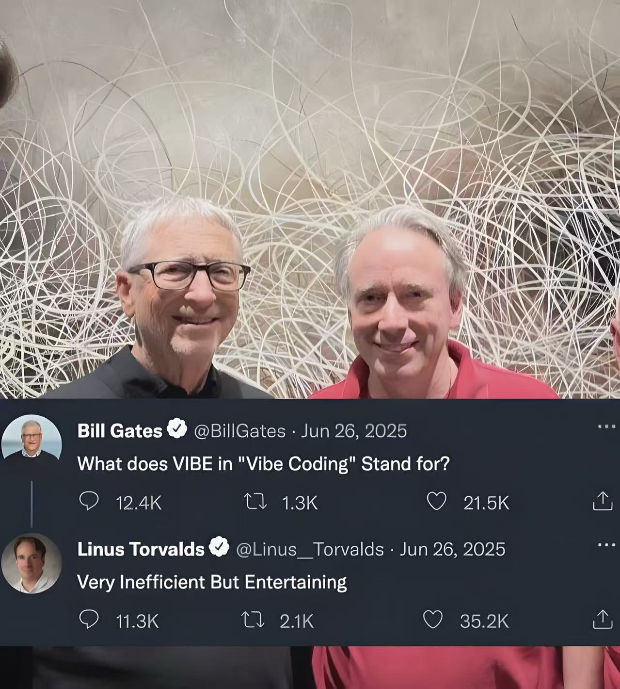

# 咩是 Vibe coding 的 vibe?

> Liuns 曰了:




    Very Inefficient But Entertaining
        效率很低但很有趣

`吐糟王`, Linus 自称第二无人敢第一吧...

- 不过, 即便现实是这样,
- 但是, Vide coding 的爆火也证明,
- 人类已经到了不再是效率第一的时代,
- 情绪价值越来越看涨而且显式..
- 所以, 未来股票可能不是根据对应企业的生产价值, 而是全体人类情绪认同程度了..
- 也就是说, 未来社会学, 有关人类心理卫生防卫的主要职能, 就是给每一个人, 及时找到自己价值认同的道路..


否则, 在 AI 赡养人类的历史阶段, 人类本身可能就因为没有人生目标而提前自行崩溃了吧...

当然, 在这一心里卫生竞赛中, 中国人绝对不可能输,

毕竟早在1992年第6期发表于《收获》的小说 《活着》就已经被余华讲出了终极意义:

    活着
    alive
        即是人生最本真的意义
    Living is the true meaning of life

大家感觉呢?


```
|> 250905 日糟:
1/4(每天吐糟不应超过4次)

            _~~&~~_
        \) /  ^ ◕  \ \/
          '_   ⏝   _'
          > '--#--' <

...act by ferris-actor v0.2.4 (built on 23.0303.201916)
```
