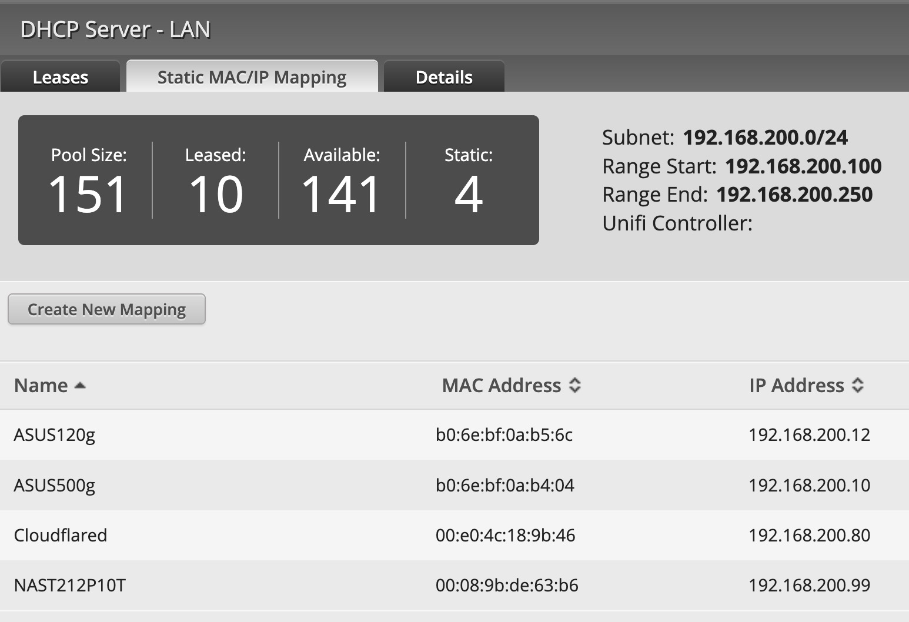

# 9.18 UBNT+Cloudflared
> gao.bo 的习惯传染 

## background

家庭网络必须完全掌握..否则, 年费大半亏的..

## goal
> 一个原则, 每一分钱都得用到点儿上

## logging
> 其实是有个漫长的调试过程的..但是, 记要起见,只说结论:

如果无法获得家庭光猫的 admin 口令, 那么我们只能使用以下方案来获得最大的带宽:

- 光猫调整为自动拨号
- 光猫直连: UBIQUITI 的 EdgwRouterX
    - 号称绝对用不坏的路由
    - 核心能力就是:
        - 将所有内网设备自动整合到一个网段
        - 并能识别 mac 地址来固定设备的内部 IP 地址
        - 这样, 才能配置其它方案, 完成安全的反向代理发布
- 然后, 将原先的各种 AP 接入路由
    - 但是, 得调整为桥接模式
    - 也就是说, AP 将不承担路由器任务, 只是简单的将光猫的网络接入转换为 wifi 热点
    - 这样,一来减少网络数据包的识别转发计算
    - 另外, 也减少了家庭网络的层次关系
    - 以及, AP 和 路由器 间最好使用超6类以上的网络直连..
    - 否则, 一般小区前装埋到墙中的线勉强能上五类而已..

通过以上整理后, 原先网速下载 10Mb/s, 上传 1Mb/s, 
提高到了 370Mb/s 以及 20Mb/s..

## refer.

- [EdgeRouter - EdgeRouter 入门指南](https://help.ui.com.cn/articles/115002531728/#%E8%BF%9E%E6%8E%A5%E8%AE%BE%E5%A4%87)
    - [EdgeRouter](https://help.ui.com.cn/articles/204976374/)
- [R7000_UM](https://www.downloads.netgear.com/files/GDC/R7000/R7000_UM.pdf)
- ..

## tracing

- 250509 DAMA init.

