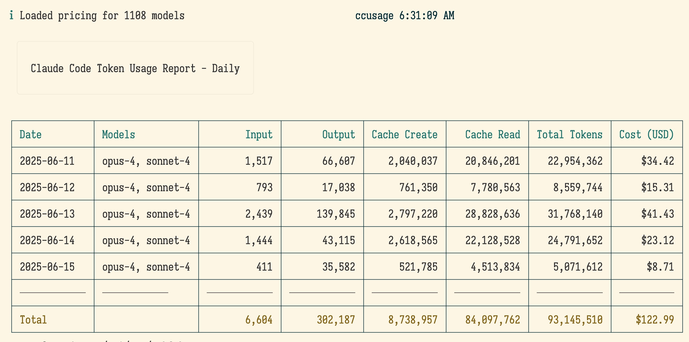
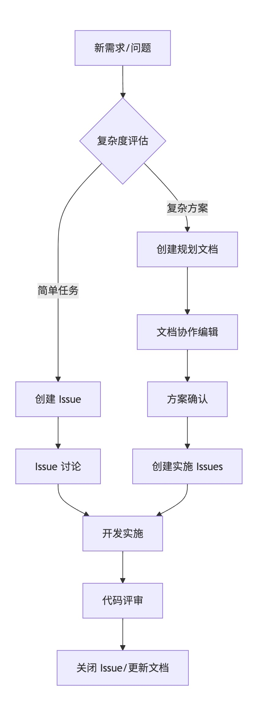

# CC 中的 gh-issue 工作流
> CC: Claude Code

## background
有幸获得 Claude Code MAX 订阅帐号,
开始真实体验完全 vibe coding,
并更加幸运的发现 @BadUncleX 组织的互助微信群;

高强度的使用了4天, 竟然也有了自己相对独特的工作流, 特此分享, 简要说明一下



## summary
> 完全迁移为原有的 Issue 开发流程..

- 创建 Issue 对任务/问题/项目/.. 进行全面规划
- 并形成子任务序列:
```

- [ ] 目标1
    + [x] 任务1.1
        + [x] 子任务 1.1.1 ~ 6d1eac5
        + [x] 子任务 1.1.2 ~ 2e71100
    + [ ] 任务1.2
        + [ ] 子任务 1.1.1
        + ..
- [ ] 目标2
- ..
```

- 然后, 随着开发, 每个任务完成, 都选中 check-box, 或是手工输入 x, 
    + 同时,在 git commit 时,将对应 Issue 的引用号, 比如 `#15` 写在 commit log 中
    + 同时将提交时的 commit hash 缀在对应行后
    + 这样就形成了 Issue-commit-repo, 的溯源链
    + 一但发生问题, 可以从 Issue 或是仓库的提交历史中, 追踪到是什么任务的什么提交, 引发的代码变化, 最终导致的 bug
- 进一步的, Issue 中还包含了丰富的表述和控制支持
    + 比如, 可以对子列表组进行整体快速拖动
    + 支持 mermaid 图形脚本
    + 支持图片的展示..
    + 这些都是仓库中 .md 文件在 VSCode 或是其它 IDE 中难以直接支持的

以上是, 以往使用 github 时形成的习惯,那时, 完全是人工来使用;
现在, gh CLI 发布, 而且是完全的终端工具, 主要功能:

**GitHub CLI (gh)**：所有 gh 命令操作

- gh auth (认证相关)
- gh repo (仓库管理)
- gh pr (Pull Request 操作)
- gh issue (Issue 管理)
- gh release (版本发布)
- gh workflow (工作流管理)
- gh api (API 调用)
- gh gist (Gist 管理)
- gh alias (别名管理)
- gh config (配置管理)
- ..

可以看到, 几乎是当前 github 所有关键功能都支持;
那么, Code 通过 gh 来将以往输出到本地仓库文件的内容, 输出为 Issue,
至少有以下好处:

- 节省本地仓库空间, 以及每次扫描仓库变化的 token, 而 Issue 几乎是无限的..
    + 一个长期项目, 可以轻量积累上万 Issue 追踪各种 任务/问题/特性/..
    + 但是, 本地仓库上万 .md , 对于所有成员来说, 想快速掌握所有过程中的知识变化, 就很难
    + 而 gh-issue 支持丰富的搜索
- 比本地 .md 文档, Issue 包含了更多效率属性:
    + 明确的给出了创建日期, 指派/标签/类型/项目/里程碑/..各种分类属性
    + 可以自然回复, 持续讨论, 在本地 .md 中的注释, 很难注意到并阅读
    + 每个 Issue 有唯一 URL, 如果是开放仓库, 那么, 这个链接可以方便的在各种场景中分享, 不象本地仓库, 指向仓库中的一个文件, 想针对文件进行讨论, 没有对应界面
    + Issue 之间的关系, 现在也支持父子的关联
    + ..

当然, Issue 不是万能的, 否则, discussions 也不会又额外发布..

所以, 将相同问题丢给 code+zen(genimi)后, 给出很多进一步的对比:


### 文档驱动的参与模式

**典型互动流程**:
```
作者起草 → 团队 review → commit comments → 文档修订 → 最终确认
```

**参与特点**:
- 📝 **深度参与**: 需要仔细阅读和思考
- 🎯 **质量导向**: 鼓励深入的技术分析
- ⏱️ **异步为主**: 适合深度工作模式
- 👤 **个人贡献**: 每个人的贡献清晰可见

**适合人群**: 喜欢深度思考的技术专家

### Issue 驱动的参与模式

**典型互动流程**:
```
创建 Issue → 快速讨论 → 分配任务 → 状态更新 → 关闭
```

**参与特点**:
- 💬 **高频互动**: 鼓励频繁的短对话
- ⚡ **敏捷导向**: 快速响应和迭代
- 🔄 **实时为主**: 适合敏捷开发模式  
- 👥 **团队协作**: 强调集体决策

**适合人群**: 喜欢快速迭代的敏捷团队

## 现代分布式团队的最佳实践

### 混合模式 (Hybrid Approach) 🔄

基于我们的分析，现代分布式团队应该采用**混合模式**，根据不同场景选择合适的协作方式：

#### 文档驱动适用场景 📄
1. **架构设计和技术方案**: 需要深度分析和长期参考
2. **知识沉淀和培训**: 新人入职、技术传承
3. **正式决策记录**: 重要的技术选型和架构决策
4. **API 文档和规范**: 需要版本控制的标准文档

#### Issue 驱动适用场景 🎯
1. **日常任务管理**: 功能开发、Bug 修复
2. **紧急问题处理**: 生产环境问题、安全漏洞
3. **敏捷迭代计划**: Sprint 规划、功能评审
4. **团队协作讨论**: 实时问题讨论、方案评审

### 推荐的混合工作流 🔀



### 工具链建议 🛠️

#### 核心工具组合
1. **Git + Markdown**: 文档版本控制和协作
2. **GitHub Issues**: 任务管理和快速讨论
3. **GitHub Projects**: 可视化项目管理
4. **Claude Code**: AI 辅助开发和文档生成

#### 自动化流程
```yaml
# .github/workflows/documentation.yml
name: Documentation Sync
on:
  push:
    paths: ['docs/plan/*.md']
jobs:
  sync-to-issues:
    runs-on: ubuntu-latest
    steps:
      - name: Create tracking issue
        run: |
          # 文档更新时自动创建跟踪 Issue
          gh issue create --title "Document Updated: ${{ github.event.head_commit.message }}"
```

### 团队协作协议 📋

#### 文档协作规范
1. **模板化**: 使用标准模板确保文档结构一致
2. **Review 机制**: 重要文档必须经过同行评审
3. **更新及时**: 决策变更时及时更新相关文档
4. **索引维护**: 保持文档索引和分类的更新

#### Issue 协作规范
1. **标签体系**: 建立清晰的标签分类系统
2. **模板使用**: 为不同类型的 Issue 提供模板
3. **及时响应**: 设定 Issue 响应时间 SLA
4. **关联管理**: 维护 Issue 与 PR、文档的关联关系


## logging
> 回顾一下如何感知并总结的过程..

- 原本根据 code 官方的使用流程来, 一切都在 CLI 中
    + 问题是, 高速流动的文字在 CLI 中, 如果不出错, 根本看不清楚
    + 如果卡住了, 也只能看到最近的一两次行为的摘要
- @BadUncleX 建议可以要求 Code 将任务分析和规划先输出为文档, 然后人工审核
    + docs/plan 作为仓库中专用目录
    + 今天(250614)更新为, 应该分模块以便并行
        + docs/plan/model-xx/..
        + docs/plan/model-xxx/..
- 而在群中有人发现 code 通过 gh 可以调用github 的 action 等更多资源..
    + 于是, 安装配置好 gh 并将仓库从 gitlab 迁移到 github 中后,
    + 自然的开始了全新的工作流

## refer.

- [Autolinked references and URLs - GitHub Docs](https://docs.github.com/en/get-started/writing-on-github/working-with-advanced-formatting/autolinked-references-and-urls)

## tracing

- 250615 DAMA init.

